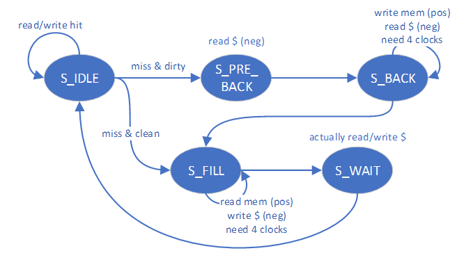

# Arch-L2 Manual

### CSR指令

***

<figure><figcaption>
CSR指令一览
</figcaption></figure>

* CSRRW：`CSRRW rd, csr, rs1` <==> GPR\[rd] = CSR\[csr], CSR\[csr] = GPR\[rs1]
* CSRRS：`CSRRS rd, csr, rs1` <==> GPR\[rd] = CSR\[csr], CSR\[csr] |= GPR\[rs1]
* CSRRC：`CSRRC rd, csr, rs1` <==> GPR\[rd] = CSR\[csr], CSR\[csr] &= \~GPR\[rs1]

> 后缀带`i`的指令将`rs1`改为立即数，本质相同

* CSRR：`CSRR rd, csr` <==> GPR\[rd] = CSR\[csr]，相当于`csrrs rd, csr, x0`
* CSRW：`CSRW csr, rs1` <==> CSR\[csr] = GPR\[rs1]，相当于`csrrw x0, csr, rs1`
* CSRS：`CSRS csr, rs1` <==> CSR\[csr] &= \~GPR\[rs1]，相当于`csrrs x0, csr, rs1`
* CSRC：`CSRC csr, rs1` <==> CSR\[csr] |= GPR\[rs1]，相当于`csrrc x0, csr, rs1`

### ECALL & MRET指令

***

<figure><figcaption>
ECALL
</figcaption></figure>

<figure><figcaption>
MRET
</figcaption></figure>

***

### CSR寄存器

* CSRRegs（Control Status Registers）：在特权模式下的一组特殊的寄存器，用于修改硬件线程的行为或者状态，例如CPU执行状态、类型、trap handler地址。
  * Input：
    * `clk, rst`
    * `[11:0] raddr, waddr`：读写地址
    * `[31:0] wdata`：读数据
    * `csr_w`：写使能信号
    * `[1:0] csr_wsc_mode`：写模式
      * 00、01：在对应寄存器写入待写入数据（CSRRW）
      * 10：在对应寄存器原有数据基础上 位或 待写入数据（CSRRS）
      * 11：在对应寄存器原有数据基础上 位与 待写入数据取反的结果（CSRRC）
  * Local Vars：
    * `reg[31:0] CSR [0:15]`：模块内部的CSR寄存器
    *   地址相关，以读地址为例（写地址判断赋值语句类似）：

        * `wire raddr_valid`：检测是否是合法的读地址，要求`raddr[11:7] == 5'h6 && raddr[5:3] == 3'h0`。对应到地址表里即意味着：寄存器可读写，当前模式为`Machine`模式。
        * `wire[3:0] raddr_map` ：读地址映射，值为`(raddr[6] << 3) + raddr[2:0]`。在本次实验中需要用到的寄存器的为：

        <table><thead><tr><th width="117" align="center">raddr[6]</th><th width="115" align="center">raddr[2:0]</th><th align="center">CSR名称</th><th width="208" align="center">用途</th><th width="222" align="center">主要变量</th></tr></thead><tbody><tr><td align="center">0</td><td align="center">000</td><td align="center">mstatus</td><td align="center">进入 trap 之前，把异常发生前 CPU 的状态信息保存到 mstatus 中。退出 trap 时，通过 mstatus 的存储值来恢复 CPU 的状态信息</td><td align="center">MPP：trap前权限 MIE：中断使能信号 MPIE：trap前中断使能信号</td></tr><tr><td align="center">0</td><td align="center">101</td><td align="center">mtvec</td><td align="center">存储异常处理跳转到 trap 的基地址</td><td align="center">Base：trap基地址 Mode：跳转方式（本实验为Direct，即所有异常均跳转到基地址）</td></tr><tr><td align="center">1</td><td align="center">001</td><td align="center">mepc</td><td align="center">记录发生异常/中断的指令地址，分别为当前PC和下一PC</td><td align="center">mepc</td></tr><tr><td align="center">1</td><td align="center">010</td><td align="center">mcause</td><td align="center">记录异常/中断发生的原因和类型</td><td align="center">Interrupt Exception Code</td></tr></tbody></table>

        <figure><figcaption>
MSTATUS
</figcaption></figure>

        <figure><figcaption>
MTVEC
</figcaption></figure>

        <figure><figcaption>
MEPC
</figcaption></figure>

        <figure><figcaption>
MCAUSE
</figcaption></figure>
  * Output：
    * \[31:0] rdata：CSR\[raddr\_map]
    * \[31:0] mstatus：CSR\[0]

### Exception & Interrpution

***

* 本次涉及的异常介绍
  * 非法指令（ID阶段解析失败）
  * 执行ECALL指令
  * Load/Store的地址非法
  * 指令地址非法
*   本实验中涉及到的异常的检测方法

    * 非法指令：`~isFlushed_WB & exp_vector_WB[3]`
    * ECALL：`~isFlushed_WB & exp_vector_WB[2]`
    * Load/Store的地址非法：`~isFlushed_WB & exp_vector_WB[1/0]`

    > `exp_vector_WB[3:0] == { illegal_inst, ECALL, l_access_fault_MEM, s_access_fault_MEM }`
    >
    > * `illegal_inst`、`ECALL`由`CtrlUnit`输出
    > * `l_access_fault_MEM, s_access_fault_MEM` 由 `RAM_B` 输出。判定依据为读/写时对应地址是否为0。
*   异常检测时间点

    WB阶段：因为这样可以保证所有的异常都在最后进行处理，这样就可以<mark style="color:red;">顺序的处理每一个异常</mark>。

<figure><figcaption>
错误图示
</figcaption></figure>

<figure><figcaption>
正确图示
</figcaption></figure>

*   处理方法

    * 保存进入trap前的状态：
      * 把先前的MIE值保留到MPIE（`mstatus[7]`），并把控制状态寄存器mstatus中的MIE（`mstatus[3]`）位设置为`0`以禁用中断。发生异常之前的权限模式保留在mstatus的MPP域（`mstatus[12:11]`）中，再把权限模式更改为M（`2'b11`）。
      * 异常指令的PC被保存在mepc中，PC被设置为mtvec（即跳转到trap handler的基地址）。mepc指向导致异常的指令；对于中断，它指向中断处理后应该恢复执行的位置。
      * 根据异常来源设置mcause，并将mtval设置为出错的地址或者其它适用于特定异常的信息字。下面是实验中会用到的mcause存储的异常类型：

    | Interrupt | Exception Code |      异常类型     |
    | :-------: | :------------: | :-----------: |
    |     1     |        0       |    Reserved   |
    |     0     |        2       |      非法指令     |
    |     0     |        5       |    Load地址非法   |
    |     0     |        7       | Store/AMO地址非法 |
    |     0     |       11       |     ECALL     |

    * 进行中断处理：本实验采用单一的trap\_handler的基地址（`mtvec[1:0] == 2'b0` / mode设置为Direct），然后直接进入trap\_handler进行处理。
    * 退出trap（M模式下为mret）：把先前的MPIE（`mstatus[7]`）值保留到MIE（`mstatus[3]`），并把控制状态寄存器mstatus中的MIE位设置为`1`以重新启用中断。当前模式重新设置为mstatus的MPP域（`mstatus[12:11]`），再把MPP域名更改为M（`2'b11`）。

<figure><figcaption>
RISC-V权限模式
</figcaption></figure>

### ExceptionUnit

<figure><figcaption>
模块注释
</figcaption></figure>

* 中断与恢复采用的状态机

<figure><figcaption>
ExceptionUnit采用的状态机
</figcaption></figure>

1. STATE\_IDLE →(exception or interruption) STATE\_MEPC
   1. write mstatus -> 保存进入trap前的权限、中断使能
   2. flush all the pipeline registers
   3. if exception (not interrupt), cancal regwrite
   4. record epc and cause -> 带宽原因，先对epc和cause进行保留
2. STATE\_MEPC → STATE\_MCAUSE
   1. write epc to mepc
   2. read mtvec -> trap基地址
   3. set redirect pc mux (next cycle pc → mtvec)
3. &#x20;STATE\_MCAUSE → STATE\_IDLE
   1. write cause to mcause
4. STATE\_IDLE → (mret) STATE\_IDLE
   1. write mstatus -> 恢复进入trap前的权限、中断使能
   2. read mepc  -> 恢复中断处理后的PC
   3. set redirect pc mux (next cycle pc → mepc)
   4. flush pipeline registers (EM, DE, FD)
5. STATE\_IDLE → (csr insts) STATE\_IDLE
   * csr operations
6. STATE\_IDLE → (other) STATE\_IDLE
   * 不做特殊操作

> Tips：
>
> * 虽然状态机里给出了明确的操作，但是也需要注意没有提及的变量需要恢复为默认值。
> * 由于架构原因，CSR寄存器的贷款受到了极大的限制，即每个时钟周期只允许一次对CSR寄存器的读和写（读写的寄存器可以不同），所以才推出了这个状态机来进行适配。
> * 在仿真过程中，遇上了非常多的代码逻辑正确，结果却完全错误的问题。经过个人在波形仿真的一通乱逛下，发现这很有可能是因为：CSR寄存器读写的正边沿触发，以及状态机的正边沿触发造成了冲突，这也使得DEBUG时很难理清思路，故状态机使用负边沿触发以避免这样的冲突。
> * 在实际给到的代码中，rom.hex的trap位置缺失了最后几行的`addi x0, x0, 0`，结果这导致后续的`mret`的返回出现了问题，<mark style="color:red;">故在实际操作中，还是补上了这一串指令</mark>。（Also，Vivado诡异的cache机制害得我在绝对路径下开了个新的rom.hex来进行指令读取......）
> * mstatus里的权限保存和恢复实际上不严谨，出现了user模式访问machine模式的问题，不过就实验本身而言无伤大雅。
